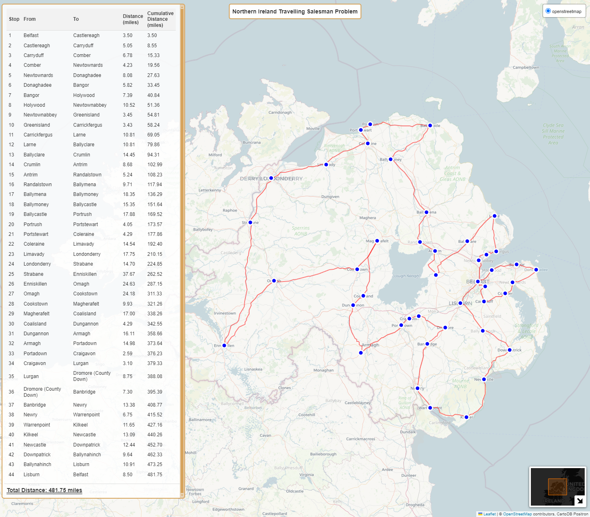

# NI-TSP: Optimising Travel Routes in Northern Ireland

This project explores the classic Traveling Salesperson Problem (TSP) to find the shortest possible driving route that visits a set of towns and cities in Northern Ireland, returning to the starting point.

## What is the Traveling Salesperson Problem (TSP)?

The TSP is a well-known optimisation problem where:

- You have a list of locations (towns or cities) and the distances between each pair.
- The goal is to find the shortest possible route that visits each location exactly once and returns to the origin.

## Project Overview

This project uses real-world road network data and powerful optimisation algorithms to solve the TSP for a selection of towns and cities across Northern Ireland.

**Key Features:**

- **Geocoding:**  Latitude and longitude coordinates for each location are obtained using the `geopy` library.
- **Road Network Data:**  The `osmnx` library is used to download and process road network data for Northern Ireland.
- **Distance Matrix:**  A distance matrix is calculated, representing the shortest driving distances between all pairs of locations.
- **TSP Algorithms:**  The project implements and compares various TSP algorithms, including:
    - 2-opt
    - Nearest Neighbor (with multiple starts)
    - Nearest Neighbor followed by 2-opt optimisation
    - Genetic Algorithm
    - Simulated Annealing
- **Visualisation:**  The optimal route is visualised on an interactive map using the `folium` library. The map includes:
    - Route lines
    - Markers for each location
    - A table summarising the route segments and distances

## Results

The project analyses the performance of different TSP algorithms and presents the shortest route found. The results are summarised in the code output and visualised on the interactive map.

